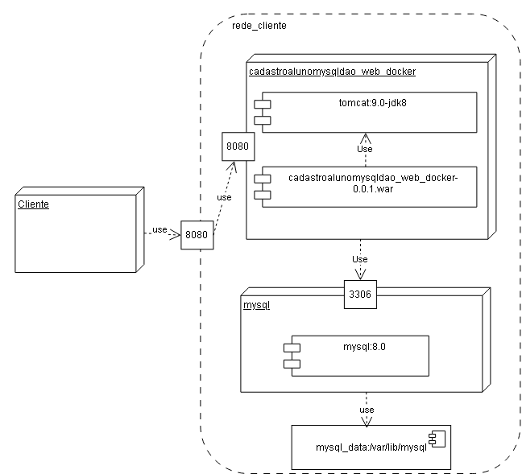

# Sistema de Cadastro de Alunos WEB com Docker Compose e MySQL

Sistema de Cadastro de Aluno WEB com Docker Compose e Banco de Dados MySQL e Docker Compose.

## Sobre o projeto
 - O projeto foi desenvolvido no NetBeans deve ser chamado **cadastroalunomysqldao_web_docker**.
 - Utiliza o **Java 8**.
 - Utiliza o **Apache Tomcat 9** como servidor de aplicações Web.
 - Utiliza o **Apache Maven** para automatizar o processo de construção da aplicação.
 - A aplicação é empacotada no formato **WAR (Web Application Archive)**.
 - Utiliza o **Docker** para criar e executar os containers da aplicação e do banco de dados.
 - Utiliza o **Docker Compose** para definir e gerenciar os serviços da aplicação. 
 - Utiliza o **MySQL 8.4** como banco de dados da aplicação. 
 - O projeto é um **CRUD** para os dados de aluno (id, nome, idade, curso e fase).
 - As classes do projeto está organizado nos **pacotes** visão, controle, modelo e dao.
 - Toda iteração com banco de dados é tratada diretamente pelo **DAO**(Data Access Object).
 - Os dados de **configuração** (Servidor, Database, Usuario, Senha) da integração do java com o banco de dados estão no arquivo src/dao/AlunoDAO.java.
 - A **interface gráfica** foi construída utilizando HTML, JavaScript e CSS.

## Docker
 - Utilizar o terminal do Windows Powershel em modo administrador.

### Para criar os conteiner e os serviços
 - ```docker compose up --build```

### Parar os serviços
 - ```docker compose down -v```

### Abra o navegador em:
 - http://localhost:8080/

### Remover as imagens
 - ```docker compose down --rmi all```

## Banco de dados

- O banco de dados e a tabela são criados no primeiro acesso ao banco de dados MySQL.

### Cria a tabela de tb_alunos

- Abaixo o script SQl se precisar criar o banco de dados e a tabela[banco.sql](banco.sql).

```
# Criar o database chamado db_alunos
create database if not exists db_alunos;

# Entrar no database db_alunos
use db_alunos;

# Remover a tabela para recriá-la
drop table if exists tb_alunos;

# Criar a tabela de tb_alunos
create table tb_alunos (id      integer not null, 
                        nome    varchar(100), 
                        idade   integer,
                        curso   varchar(50),
                        fase    integer,
                        constraint pk_tb_alunos primary key(id));

```

## Interface gráfica WEB

### Tela do menu principal do programa.


### Tela para cadastrar novos alunos.


### Tela para gerenciar alunos (alterar e apagar).


## Arquivos

- banco.sql - Script do banco de dados.
- pom.xml - Arquivo de configuração da ferramenta de automação Maven.
- *.png - Arquivos de imagens do README.md.
- Dockerfile - Arquivo de configuração do Docker.
- compose.yml - Arquivo de configuração da composição do Docker.

## Arquitetura do Sistema



## Docker Hub
 - https://hub.docker.com/r/osmarbraz/cadastroalunomysqldao_web_docker